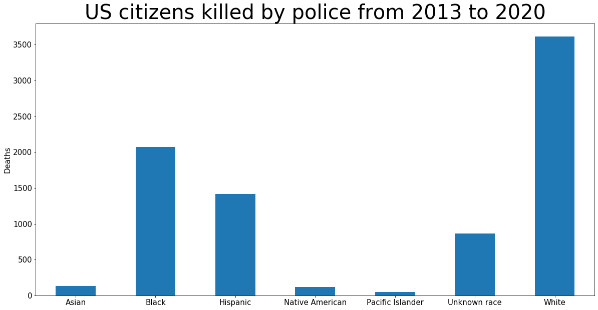
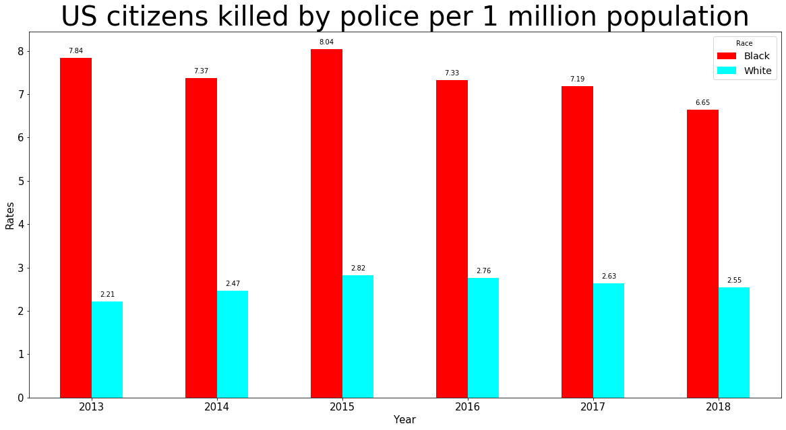

# police-violence-rates
In the US, do more white people die at the hands of law enforcement than African Americans?

Not so long ago, Donald Trump claimed that more white people die at the hands of law enforcement than African Americans. Is he lying? Rhetorical question; Of course he is. Let’s use Python to find out how. 

Trump's claims: https://www.theguardian.com/us-news/2020/jul/14/donald-trump-george-floyd-police-killings

If we use the absolute numbers we’ll see that more white people are killed than any other race. Why? They comprise around 60% of the population. African Americans make up for about 12%. Not taking demographics into account is misleading. 

You’d expect the president of the US to understand how rates work in this situation: Police Victims / Size of the population among which the deaths occured. We multiply that by 1 million and…

US Population Source: https://www.kff.org/other/state-indicator/distribution-by-raceethnicity/

Police violence source: https://mappingpoliceviolence.org/
